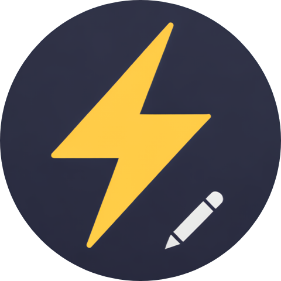
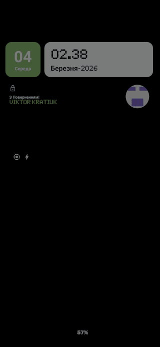

  

  
  &nbsp;
  
  &nbsp;
  
   
  
  &nbsp;
  

<h2 align="center">🎬 Preview</h2>

> Example capture from voice input: `“I have an idea: an app that shows which cafés are quiet right now.”`

  

<h2 align="center">✨ Features</h2>

- 🚀 **Built‑in Whisper transcription** (choose English, Ukrainian, or German in Settings)
- 🔔 **Persistent notification** with full customization (title, description, button labels, icon)
- 📴 **Fully offline**

<h2 align="center">⚙️ Scripts</h2>

| Task | Command | Description |
| --- | --- | --- |
| Debug · Update | `./gradlew debugUpdate` | Build + install debug APK, then launch app (no uninstall) |
| Debug · Reinstall | `./gradlew debugReinstall` | Uninstall → build + install debug APK → launch app |
| Release · APK | `./gradlew assembleRelease` | Build release APK (no install) |

> ⚠️ Note: For debug commands, ADB device must be connected and authorized
